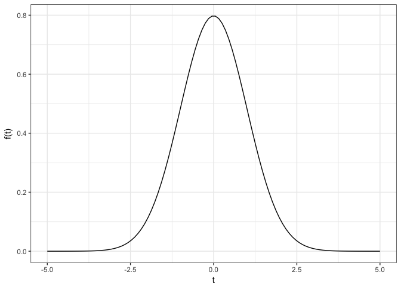
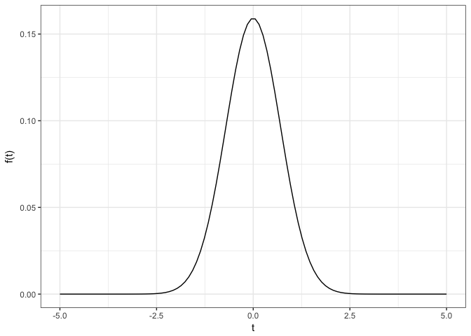

<!-- README.md is generated from README.Rmd. Please edit that file -->

## Overview of the `fuse` package

The `fuse` package (which stands for ***FU**nctions with **S**pace
**E**mbedding*) provides `R6` classes for describing functional data
with embedding in infinite-dimensional Hilbert spaces. Currently
supported spaces are Sobolev spaces (including the popular \(L^2\) space
of square-integrable functions) and Bayes spaces. In particular,
addition, scalar multiplication, inner product and induced distance
provide the vector space structure of each supported Hilbert space.

The `R6` class implementation enables reference semantics which
authorizes in-place operations, assigning only once the value in memory.
The object is then accessed through its pointer which avoids repeatedly
creating and deleting objects into memory. This has however to be
manipulated with caution because methods accessed through the public
members of the `R6` class do modify on purpose the object. For users who
would not want that extra level of reasoning or who would not need the
computational speed-up provided by reference semantics, the package
provides usual `S3` methods for objects of class `FunctionalData` for
all `S3` generics in the `Math`, `Ops`, `Summary` and `Complex` groups.

*Warning:* The package currently supports only univariate functional
data defined over univariate domains. Extensions to multivariate domains
and multivariate functional data is currently under implementation.

## Installation

You can install `fuse` from github with:

``` r
# install.packages("devtools")
devtools::install_github("astamm/fuse")
```

## Example

``` r
library(fuse)
```

We can for example generate a `FunctionalData` version of the density of
the standard normal distribution. If we create it embedded in Sobolev
spaces and multiply it by `2`, we obtain the following function:

``` r
f <- SobolevData$new(grid = c(-5, 5), value = dnorm, resolution = 100L)
(2 * f)$plot()
```

<!-- -->

This is essentially the original density pointwise multiplied by a
factor of `2` which does not result in a density anymore. If instead we
embed the density of the standard normal distribution in Bayes space and
again multiply it by `2`, we get:

``` r
g <- BayesData$new(grid = c(-5, 5), value = dnorm, resolution = 100L)
(2 * g)$plot()
```

<!-- -->

This shows a fundamental difference between Sobolev and Bayes spaces. In
the latter, adding twice the information content in `g` provides
additional information and thus has the effect of diminishing the
variance of the resulting distribution which turns out to be another
centered normal distribution with smaller variance.
